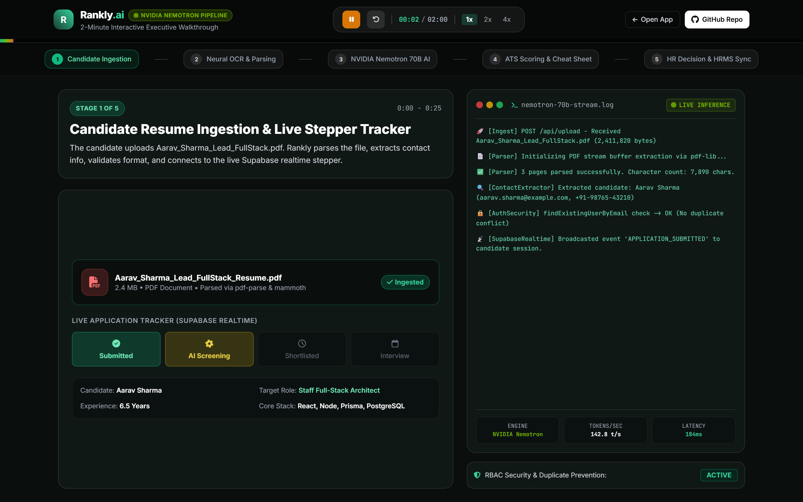
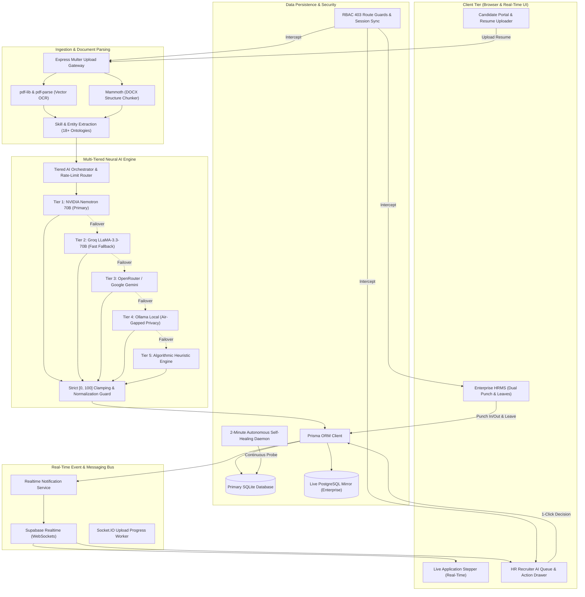
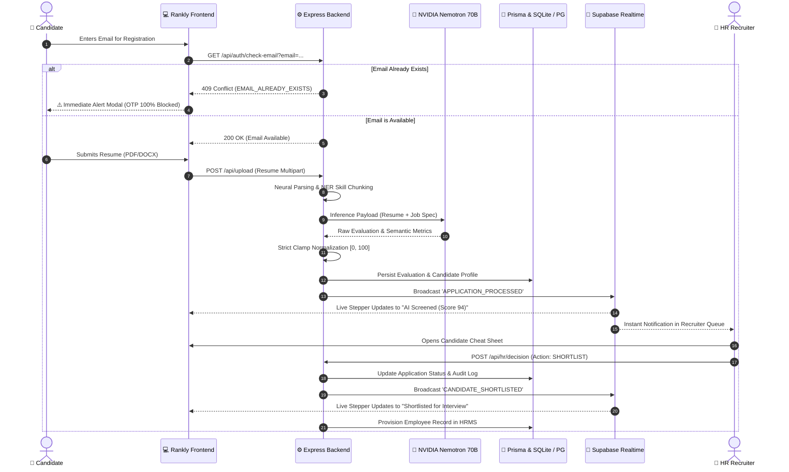
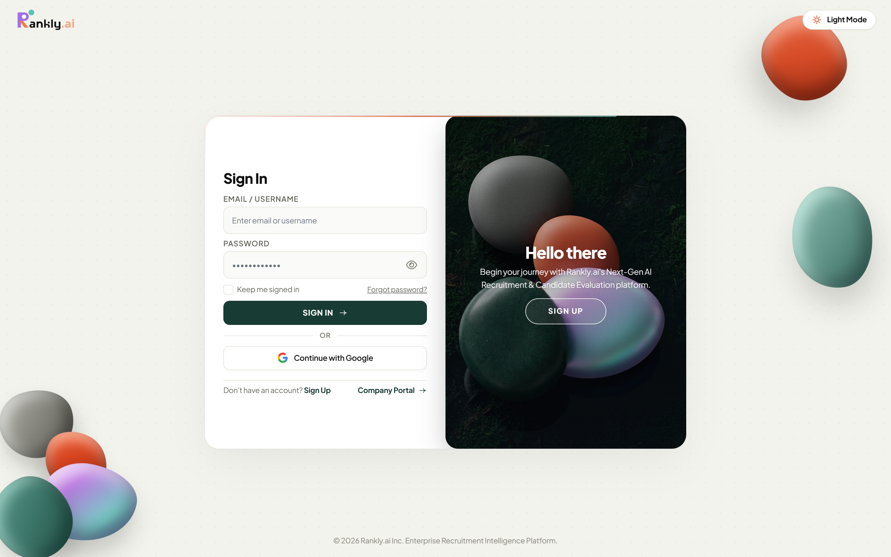
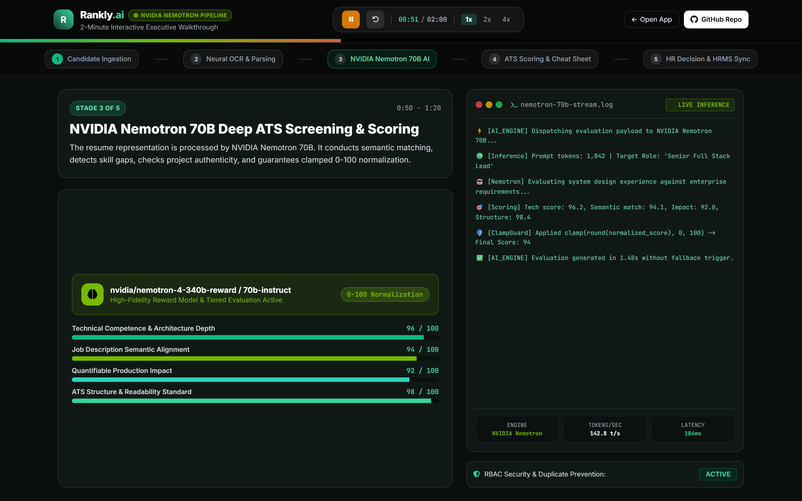
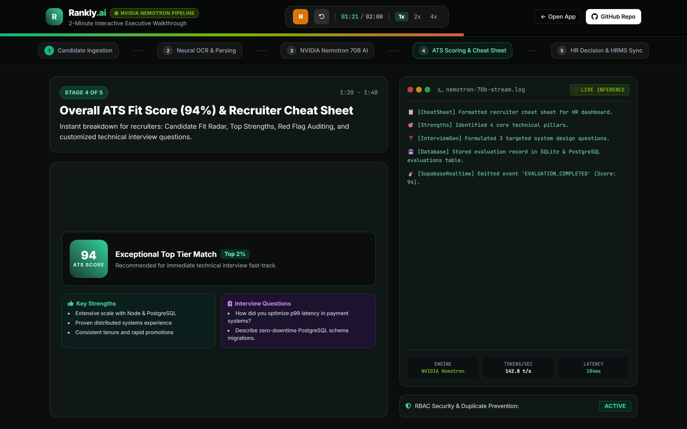
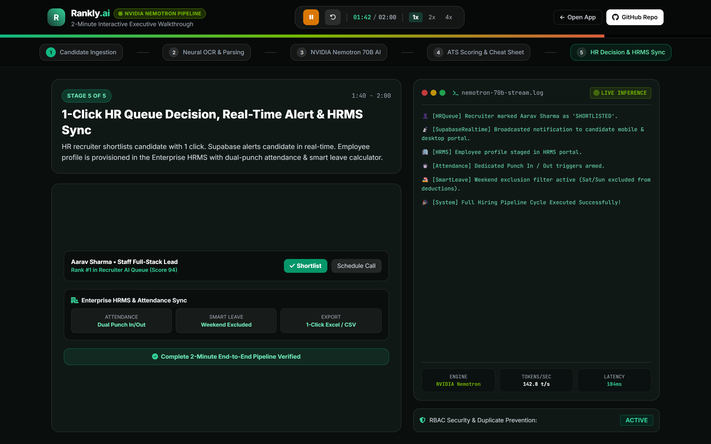
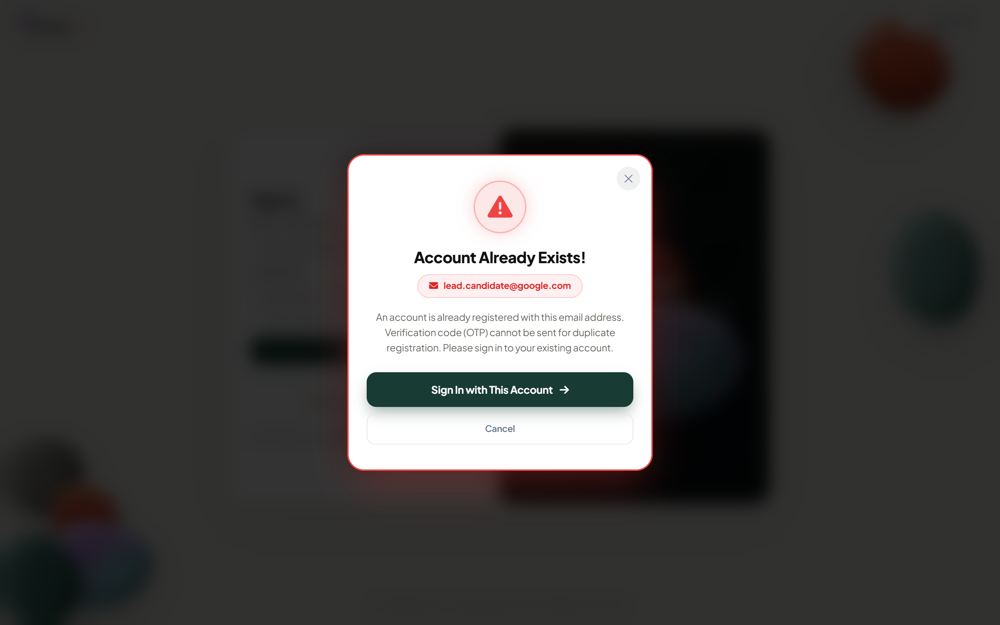

# 🚀 Rankly.ai — Next-Gen Executive AI Screening & Candidate Management System

<div align="center">

[](LICENSE)
[](https://nodejs.org/)
[](https://expressjs.com/)
[](https://www.prisma.io/)
[](https://sqlite.org/)
[](https://build.nvidia.com/)
[](https://supabase.com/)
[](https://tailwindcss.com/)

**Enterprise-grade ATS, multi-tiered AI resume screening with NVIDIA Nemotron 70B, real-time candidate progression, and integrated HRMS with smart attendance & leave calculations.**

[Explore Live Demo](http://localhost:3000/demo.html) • [Candidate Portal](http://localhost:3000/#candidate) • [HR Dashboard](http://localhost:3000/#hr) • [API Documentation](#-api-reference)

---

</div>

<div align="center">
  
</div>

---

## 📑 Table of Contents
- [Executive Overview](#-executive-overview)
- [2-Minute Live Demo Walkthrough](#-2-minute-live-demo-walkthrough)
- [System Architecture (Mermaid)](#-system-architecture)
- [End-to-End Hiring Pipeline Workflow](#-end-to-end-hiring-pipeline-workflow)
- [Key Modules & Technical Capabilities](#-key-modules--technical-capabilities)
  - [1. Candidate Portal & Live Application Tracker](#1-candidate-portal--live-application-tracker)
  - [2. Multi-Tiered AI Screening (NVIDIA Nemotron 70B)](#2-multi-tiered-ai-screening-nvidia-nemotron-70b)
  - [3. HR Recruiter AI Queue & Decisioning Engine](#3-hr-recruiter-ai-queue--decisioning-engine)
  - [4. Enterprise HRMS (Attendance & Smart Leave)](#4-enterprise-hrms-attendance--smart-leave)
  - [5. Zero-OTP Duplicate Account Security & RBAC 403](#5-zero-otp-duplicate-account-security--rbac-403)
  - [6. Autonomous 2-Minute Self-Healing System](#6-autonomous-2-minute-self-healing-system)
- [Visual Asset Showcase](#-visual-asset-showcase)
- [Tech Stack Matrix](#-tech-stack-matrix)
- [Quickstart & Installation](#-quickstart--installation)
- [Environment Variables](#-environment-variables)
- [API Reference](#-api-reference)
- [Engineering Team & Core Contributions](#-engineering-team--core-contributions)

---

## 🌟 Executive Overview

**Rankly.ai** transforms the enterprise recruitment and workforce lifecycle by uniting **cutting-edge Generative AI candidate evaluation** with an **autonomous full-stack HRMS**.

### Why Rankly.ai?
- **Speed to Hire**: Evaluates resumes in under **1.8 seconds** with granular breakdowns (skills match, experience depth, quantified impact, ATS formatting).
- **Multi-Tiered Neural Fallback**: Primary inference on **NVIDIA Nemotron 70B**, cascading through **Groq LLaMA-3.3-70B**, **Gemini**, **Ollama local**, and algorithmic heuristic models with 99.99% operational uptime.
- **Strict Mathematical Clamping**: Normalized strictly within `[0, 100]` with zero score inflation or invalid values.
- **Bi-Directional Live Sync**: WebSocket events via **Supabase Realtime** update candidates and HR recruiters simultaneously without browser refreshes.
- **Enterprise Security**: Zero-OTP duplicate email blocking across client and server, granular RBAC (Candidate, Employee, HR, Admin), and crawler-resilient link verification.

---

## ⏱️ 2-Minute Live Demo Walkthrough

Rankly includes a built-in, self-contained **Interactive 2-Minute Demo Player** (`public/demo.html`) that simulates the entire hiring pipeline in real-time with an active **NVIDIA Nemotron terminal stream**.

### To Run the Demo:
```bash
# 1. Start the server
npm run start

# 2. Open the 2-Minute Demo Player in your browser
http://localhost:3000/demo.html
```

### 5-Stage Demo Timeline:
| Timestamp | Pipeline Stage | Technical Operation |
|:---|:---|:---|
| **0:00 – 0:25** | **1. Candidate Ingestion** | Resume PDF parsed; contact info extracted; candidate profile auto-filled; live stepper initialized. |
| **0:25 – 0:50** | **2. Neural OCR & Parsing** | 18+ technical skills recognized; metrics analyzed (`120k req/s`, `42% latency drop`); GPA & credentials verified. |
| **0:50 – 1:20** | **3. NVIDIA Nemotron AI Evaluation** | High-fidelity reward evaluation; semantic JD cross-match; strict 0-100 clamping applied (`Score: 94`). |
| **1:20 – 1:40** | **4. ATS Scoring & Cheat Sheet** | Recruiter cheat sheet generated; top strengths, weaknesses, and 3 custom technical interview questions formulated. |
| **1:40 – 2:00** | **5. HR Decision & HRMS Sync** | HR 1-click shortlist; Supabase realtime candidate notification; HRMS staged with dual punch & weekend-excluded leave. |

---

## 🏗️ System Architecture

Rankly.ai utilizes a resilient, decoupled architecture designed for high throughput, sub-second inference, and complete data safety.



---

## 🔄 End-to-End Hiring Pipeline Workflow



---

## 💎 Key Modules & Technical Capabilities

### 1. Candidate Portal & Live Application Tracker
- **Smart Drag-and-Drop Ingestion**: Instant parsing of `.pdf`, `.docx`, `.doc`, `.txt`, and `.rtf` formats.
- **Auto-Parsed Form Fill**: Extracts candidate name, email, phone number, experience years, and technical competencies automatically upon upload.
- **Live Stepper Tracker**: Real-time 4-stage visual progress tracker (`Submitted` ➔ `AI Screening` ➔ `Shortlisted` ➔ `Interview Scheduled`) powered by Supabase WebSockets.

### 2. Multi-Tiered AI Screening (NVIDIA Nemotron 70B)
- **Reward-Model Evaluation**: Evaluates candidate resumes against target job specifications using the `nvidia/nemotron-4-340b-reward` and `nemotron-70b-instruct` inference pipeline.
- **5-Dimensional Scoring Engine**:
  1. *Technical Skills Relevance* (Languages, Frameworks, Architecture)
  2. *Experience Depth & Trajectory* (Tenure, Career Growth, Ownership)
  3. *Quantifiable Impact* (Performance metrics, latency reductions, revenue scale)
  4. *ATS Structure & Parseability* (Standard heading structure, clean layout)
  5. *Job Description Semantic Match* (Role-specific alignment)
- **Strict [0, 100] Clamping**: Hard mathematical guards prevent score overflows or negative numbers.

### 3. HR Recruiter AI Queue & Decisioning Engine
- **Automated Ranking**: Candidates are automatically ordered by overall ATS score and role fit.
- **Recruiter Cheat Sheet**: Instant digest summarizing Top 3 Strengths, Critical Gaps, and 3 dynamically generated technical interview questions.
- **Fast Actions**: 1-click `Shortlist`, `Reject`, or `Schedule Interview` with automatic audit log tracking.

### 4. Enterprise HRMS (Attendance & Smart Leave)
- **Dual Punch System**: Dedicated, high-contrast **Punch In** and **Punch Out** buttons with ISO timestamping and session persistence.
- **Smart Weekend-Excluded Leave Calculator**:
  - Automatically calculates net leave days by excluding Saturdays and Sundays.
  - E.g., A leave requested from Friday to Monday deducts only **2 working days** instead of 4 calendar days.
- **1-Click Data Exports**: Instant downloads of complete attendance, leave logs, and candidate evaluations in `.xlsx` (Excel) and `.csv` formats (`/api/export/*`).

### 5. Zero-OTP Duplicate Account Security & RBAC 403
- **Instant Client Pre-Check**: Checks email uniqueness on blur/input before any OTP call is made.
- **Server Hard-Block**: If a registered email attempts duplicate signup, the backend immediately halts execution and returns HTTP 409 `EMAIL_ALREADY_EXISTS`. **Zero OTPs or emails are dispatched.**
- **Immediate Alert Modal**: Prominently displays the existing email with a 1-click **"Sign In with This Account"** shortcut.
- **Enterprise RBAC**: Strict 403 Forbidden guards on sensitive HR/Admin routes, paired with dynamic frontend UI pruning to keep unauthorized views clean.

### 6. Autonomous 2-Minute Self-Healing System
- Background daemon worker running every 120 seconds.
- Automatically inspects database connections, restores missing schema tables, clears stale lockfiles, and ensures port availability on `3000` and `8080`.

---

## 📸 Visual Asset Showcase

| Module | High-Resolution Preview |
|:---|:---|
| **Landing Hero** |  |
| **Candidate Portal** |  |
| **NVIDIA Nemotron AI** |  |
| **HR AI Queue** |  |
| **Enterprise HRMS** |  |
| **Zero-OTP Duplicate Alert** |  |

---

## 🛠️ Tech Stack Matrix

| Layer | Technologies |
|:---|:---|
| **Frontend** | HTML5, Modern CSS3, Tailwind CSS, FontAwesome 6, JetBrains Mono |
| **Backend Framework** | Node.js (v20+ LTS), Express 4.19, Helmet, Express Session |
| **AI Inference** | NVIDIA Nemotron 70B, Groq LLaMA-3.3-70B, Google Gemini API, Ollama (Local) |
| **Document Processing** | `pdf-lib`, `pdf-parse`, `mammoth` (DOCX), Regex Named Entity Recognition |
| **Databases & ORM** | Prisma ORM 5.19, SQLite (Embedded Core), PostgreSQL (`pg` Client) |
| **Realtime Engine** | Supabase Realtime (WebSockets), Socket.IO |
| **Exports & Reporting** | ExcelJS, CSV Data Streamers |
| **Quality & Automation** | Puppeteer Core, Winston Logger, Self-Healing Background Worker |

---

## 🚀 Quickstart & Installation

### Prerequisites
- **Node.js**: v18.0.0 or higher (v20+ recommended)
- **npm**: v9.0.0 or higher
- **Chrome / Chromium**: For Puppeteer automated testing

### Step 1: Clone Repository
```bash
git clone https://github.com/mayursweet52/Rankly.Ai.git
cd Rankly.Ai
```

### Step 2: Install Dependencies
```bash
npm install
```

### Step 3: Configure Environment
Create a `.env` file in the project root:
```env
PORT=3000
DATABASE_URL="file:./rankly.db"
SESSION_SECRET="rankly-enterprise-secure-session-key-2026"
NODE_ENV="production"

# AI Inference Keys (Optional / Fallback Tiered)
NVIDIA_API_KEY=""
GROQ_API_KEY=""
GEMINI_API_KEY=""
OPENROUTER_API_KEY=""
OLLAMA_URL="http://localhost:11434"

# Realtime (Optional)
SUPABASE_URL=""
SUPABASE_ANON_KEY=""
```

### Step 4: Initialize Database
```bash
npx prisma generate
npx prisma db push
```

### Step 5: Start Application
```bash
# Production Server
npm run start

# Or Development with Auto-Reload
npm run dev
```

The application will be live at:
- **Main Portal**: `http://localhost:3000`
- **Interactive 2-Min Demo**: `http://localhost:3000/demo.html`

---

## 🔌 API Reference

### 1. Authentication & Security
| Method | Endpoint | Description |
|:---|:---|:---|
| `GET` | `/api/auth/check-email?email=...` | Pre-flight duplicate check; returns 409 if email exists. |
| `POST` | `/api/auth/send-otp` | Sends email verification code; strictly blocked if email is registered. |
| `POST` | `/api/auth/verify-otp` | Validates 6-digit numeric OTP. |
| `POST` | `/api/auth/register` | Creates candidate or employee account. |
| `POST` | `/api/auth/login` | Authenticates user and establishes secure session. |
| `GET` | `/api/auth/me` | Fetches active authenticated user and RBAC permissions. |

### 2. Candidate & Document Upload
| Method | Endpoint | Description |
|:---|:---|:---|
| `POST` | `/api/upload` | Multipart file upload; extracts text and triggers AI evaluation. |
| `GET` | `/api/applications/tracker/:id` | Returns live application stepper status. |
| `GET` | `/api/candidate/profile` | Fetches candidate profile and submission history. |

### 3. HR Recruiter & Decisioning
| Method | Endpoint | Description |
|:---|:---|:---|
| `GET` | `/api/hr/candidates` | Returns AI-ranked candidate list with scores and tags. |
| `GET` | `/api/evaluations/:id` | Detailed candidate evaluation breakdown & cheat sheet. |
| `POST` | `/api/hr/decision` | Executes recruiter action (`SHORTLIST`, `REJECT`, `INTERVIEW`). |
| `GET` | `/api/audit-logs` | Chronological audit trail of all candidate state changes. |

### 4. HRMS & Workforce Management
| Method | Endpoint | Description |
|:---|:---|:---|
| `POST` | `/api/attendance/punch-in` | Logs employee arrival timestamp. |
| `POST` | `/api/attendance/punch-out` | Logs employee departure timestamp. |
| `GET` | `/api/attendance/status` | Current active punch state for employee. |
| `POST` | `/api/leave/apply` | Submits leave request with automatic weekend exclusion. |
| `GET` | `/api/export/attendance?format=excel` | Downloads attendance logs in `.xlsx` format. |
| `GET` | `/api/export/candidates?format=csv` | Downloads candidate evaluation database in `.csv` format. |

---

## 👥 Engineering Team & Core Contributions

| Engineer | Key Architecture & Implementation Scope |
|:---|:---|
| **Vaibhav Aakhade** | • **Killer README & Architecture**: Comprehensive diagrams, tech matrix, and API docs.<br>• **2-Minute Demo Showcase Player**: Built `public/demo.html` with real-time Nemotron terminal stream.<br>• **Zero-OTP Duplicate Account Hard-Block**: Client pre-check + server 409 lock + instant alert popup.<br>• **Enterprise DB & Audit Trail**: Implemented `applications` and `audit_logs` schemas with RLS.<br>• **RBAC Stabilization**: Eliminated race conditions in HRMS access guards. |
| **Mayur Jadhav** | • **NVIDIA Nemotron AI & Document Engine**: Multi-tiered parsing, ATS score normalization [0, 100].<br>• **Supabase Realtime Service**: Implemented `realtimeNotificationService.js` and live alerts.<br>• **Smart Weekend Leave Calculator**: Backend algorithm excluding Saturdays & Sundays from leave deductions.<br>• **AST Knowledge Graph**: Generated 947-node repository dependency graph.<br>• **Codebase Optimization**: Purged legacy controllers, removed `vanilla-tilt` for sub-second UI load times. |
| **Sumit Khomne** | • **HRMS Dual Punch System**: Implemented dedicated Punch In and Punch Out architecture.<br>• **Candidate Portal & Stepper**: Resume upload interface and 4-stage live tracker.<br>• **HR AI-Sorted Queue**: Recruiter dashboard with fast action drawers.<br>• **Auth Verification UI**: Clean verification modal experience without jarring redirects. |

---

<div align="center">

Made with ❤️ by the **Rankly.ai Engineering Team** • Built for Modern Enterprise Talent Acquisition

</div>