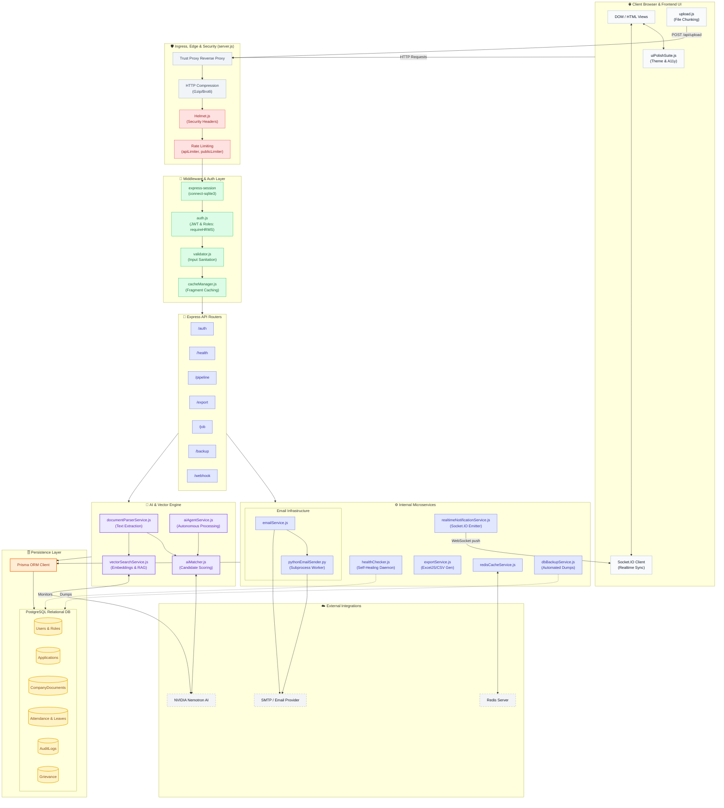

# ⚙️ Rankly.ai — Deep Mechanical Architecture Blueprint

Based on a deep codebase analysis of `server.js`, `prisma/schema.prisma`, and the `src/services/` directory, here is the ultra-detailed mechanical architecture of the Rankly.ai platform.

## Deep Mechanical Diagram

## Deep Component Analysis (Codebase Validated)

After analyzing `server.js`, `prisma/schema.prisma`, and the `src/services/` directory, here is the granular breakdown of Rankly.ai's mechanics:

### 1. Ingress & Security Stack
The application is fortified at the edge in `server.js`:
* **Trust Proxy:** Configured (`app.set('trust proxy', 1)`) to handle Load Balancers like Render or Heroku.
* **Helmet.js & Disabling Fingerprinting:** Removes `x-powered-by` and locks down HTTP security headers.
* **Compression:** Implements Gzip/Brotli for payloads over 256 bytes to ensure lightning-fast UI rendering.
* **Triple Rate-Limiting:** `apiLimiter`, `publicLimiter`, and `authenticatedLimiter` protect against brute-force and DDoS attacks.

### 2. State & Session Management
* Uses `express-session` backed by `connect-sqlite3`. This means user sessions survive server restarts and scale securely.
* `cacheManager.js` handles fragment caching to serve static or frequently-accessed data rapidly without hitting the DB.

### 3. The 29-Route Matrix
The routing layer is massively modularized into 29 distinct API endpoints. Key routers include:
* **`pipelineRoutes.js` / `candidateRoutes.js`**: Handle ATS (Applicant Tracking System) logic.
* **`grievanceRoutes.js` / `leaveRoutes.js` / `attendanceRoutes.js`**: Core HRMS functionality.
* **`exportRoutes.js`**: Triggers `exportService.js` to serialize DB arrays into downloadable Excel/CSV files.
* **`backupRoutes.js`**: Interfaces with `dbBackupService.js` to automate database snapshotting.

### 4. Advanced AI & Vector Mechanics
The AI layer is not a simple wrapper; it is a multi-stage pipeline:
* **`documentParserService.js`**: Mechanically strips formatting from resumes/documents, converting them into clean text streams.
* **`vectorSearchService.js`**: Indicates advanced Retrieval-Augmented Generation (RAG). It likely creates embeddings of company documents or job descriptions for semantic matching.
* **`aiMatcher.js` & `aiAgentService.js`**: Stream data to **NVIDIA Nemotron AI**, generating match scores, extracting skills, and creating structured evaluations.

### 5. Hybrid Email Architecture
Rankly.ai utilizes a unique hybrid email pipeline:
* Standard emails route through `emailService.js` (likely Nodemailer).
* The codebase also contains a `pythonEmailSender.py` script. The Node backend spawns a Python subprocess to handle specific/legacy SMTP protocols or bulk queue operations.

### 6. Prisma Database Schema
The SQL database is strictly typed via Prisma with high relational complexity:
* **HRMS:** Models like `Attendance` (tracks CheckIn/Out and exact WorkHours), `LeaveRequest` (Sick/Maternity with approval workflows), and `Grievance` (confidential reporting system).
* **ATS:** `CandidateApplication` and `Application` models track candidates through a strict `pending_screening` ➔ `ai_shortlisted` ➔ `hr_shortlisted` pipeline.
* **Audit Trails:** The `AuditLog` model is deeply integrated, permanently recording every state change (e.g., when a candidate is rejected, storing IP, user agent, and actor).
* **Company Setup:** `Company`, `CompanyJob`, and `CompanyDocument` manage multitenancy/organization data.

### 7. Realtime Notification Engine
Instead of just Supabase, `server.js` explicitly boots a native `Socket.IO` server attached to `realtimeNotificationService.js`. When the AI finishes evaluating a resume, or an HR admin approves a leave request, this service emits a WebSocket payload straight to the frontend, instantly updating the UI without a page refresh.
