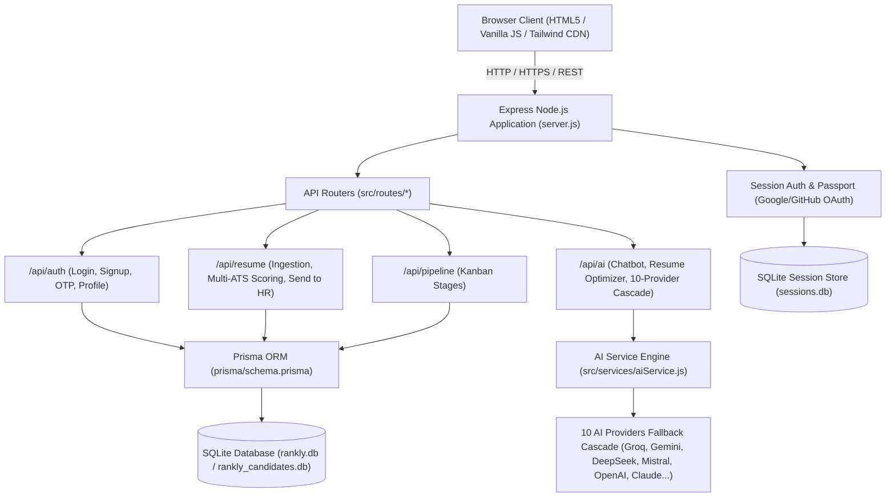

# 🏗️ Technical Architecture – Rankly.ai

**Stack Overview:** Node.js (v18+) + Express + SQLite + Prisma ORM + Tailwind CSS (CDN) + Vanilla ES6+ JS + Railway Cloud Deployment

---

## 1. 📐 System Architecture Diagram

---

## 2. 🗄️ Database & Data Layer

### 2.1 ORM & Database Engine
* **Engine:** SQLite 3 with WAL (Write-Ahead Logging) enabled.
* **ORM:** Prisma Client with automatic migration and introspection (`prisma/schema.prisma`).

### 2.2 Core Prisma Models
* `User`: Dual-track authentication, hashed passwords, verification flags, role (`admin`, `hr`, `hiring_manager`, `normal_user`), optional relation to `Organization`.
* `Organization`: Multi-tenant company container linking HR team members, evaluations, and candidates.
* `ReferralCode`: Secure invite tokens generated by admins to provision HR and HM teammates with expiration & usage caps.
* `Evaluation`: Structured ATS screening report containing resume metadata, candidate contact, scores breakdown, and skill arrays.
* `Candidate`: Entity for the Talent Pipeline Kanban board tracking stage progression (`screening`, `interview`, `offer`, `hired`).
* `ChatMessage`: Historical logs for the conversational career advisor.
* `Feedback`: Category-specific user feedback, ratings, and issue reports.

---

## 3. 🤖 AI Multi-Provider Fallback Cascade Engine

The backend (`src/services/aiService.js`) implements a resilient **10-Provider Failover Matrix**:
1. **Groq Llama 3 70B** (Primary Ultra-Fast Inference)
2. **Google Gemini 1.5 Flash / Pro**
3. **DeepSeek V3 / R1**
4. **Mistral Large**
5. **OpenAI GPT-4o / GPT-4o-mini**
6. **Anthropic Claude 3.5 Sonnet**
7. **Cohere Command R+**
8. **Together AI Open Models**
9. **OpenRouter Meta Gateway**
10. **Deterministic Heuristic ATS Rule Engine** (100% offline fallback)

---

## 4. 🌐 Frontend Architecture
* **Single-Page Application (SPA)** flow in `public/index-3.html` (synchronized to `public/index.html`).
* **Page Management:** Dynamic view toggling between `#loginPage` and `#dashboardPage`.
* **Theming Engine:**
  * **Light Theme:** Cohere-inspired organic canvas with 3D pebble gems and clean structured typography.
  * **Dark Theme:** Pure matte black (`#0a0a0f`), glowing 3D character pop-out heading, Aceternity UI Gooey candidate search, and unified pill capsule floating dock.
* **State Management:** Session/Local storage hydration, real-time candidate search filtering, and DOM updates via Vanilla JS modules.
